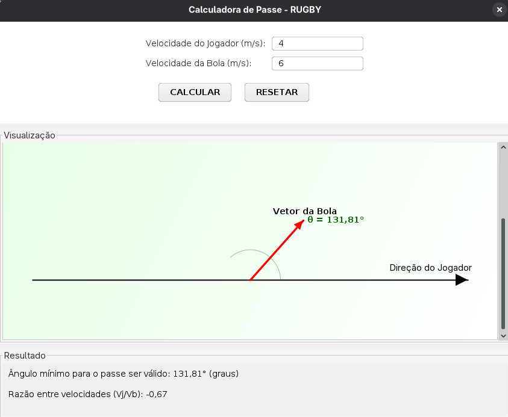

:rugby_football: Calculadora de Passe de Rugby 
#
Programa de calculadora de passe de rugby feito em java para o trabalho de fisica. O programa calcula e mostra o menor ângulo que a bola deve fazer para que o passe seja válido, de acordo com o exercício original.
#
:camera: Imagem da Calculadora:

#
:wrench: Funcionalidades da Calculadora:

  :white_check_mark:Interface gráfica(swing)

  :white_check_mark:Calculo do passe

  :white_check_mark:Erros são mostrados e tratados com mensagens
